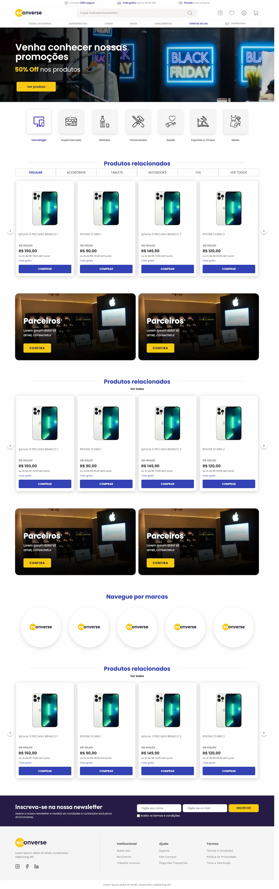

# Teste Front-End Econverse

Página de e-commerce desenvolvida em **React + TypeScript + Sass** a partir do layout fornecido no Figma, com vitrine de produtos consumindo a API do teste e modal de detalhes do produto.



> Layout desktop (1440px), conforme o Figma fornecido, que não inclui versão mobile.

## Tecnologias

- [React 19](https://react.dev/) + [TypeScript](https://www.typescriptlang.org/)
- [Vite](https://vite.dev/) (ambiente de desenvolvimento e build)
- [Sass](https://sass-lang.com/) com CSS Modules
- ESLint + Prettier

Nenhuma biblioteca de UI, carrossel ou modal foi usada: todos os componentes foram feitos do zero.

## Como rodar

Pré-requisito: [Node.js](https://nodejs.org/) (desenvolvido e testado com a versão 24).

```bash
# 1. Clonar o repositório
git clone https://github.com/ivoalsilva/teste-front-end.git
cd teste-front-end

# 2. Instalar as dependências
npm install

# 3. Rodar em modo de desenvolvimento
npm run dev
```

A página abre em `http://localhost:5173`.

### Scripts disponíveis

| Comando           | O que faz                                                             |
| ----------------- | --------------------------------------------------------------------- |
| `npm run dev`     | Inicia o servidor de desenvolvimento                                  |
| `npm run build`   | Verifica os tipos (TypeScript) e gera a versão de produção em `dist/` |
| `npm run preview` | Serve localmente a versão de produção gerada pelo build               |
| `npm run lint`    | Analisa o código com o ESLint                                         |
| `npm run format`  | Formata o código com o Prettier                                       |

### Testes

O projeto não possui testes automatizados. A verificação é feita por:

- **Type check** do TypeScript (executado no `npm run build`)
- **Lint** com ESLint (`npm run lint`)
- **Conferência visual com o Figma**: cada seção foi medida no Figma e comparada com a posição real dos elementos no navegador (via `getBoundingClientRect` no console)

## Estrutura do projeto

```
src/
├── assets/          # Logo, ícones (SVG) e imagens (WebP/PNG)
├── components/      # Um componente por pasta: .tsx + .module.scss
│   ├── Header/
│   ├── Banner/
│   ├── Categories/
│   ├── ProductShelf/    # Vitrine com abas e carrossel (usada 3 vezes)
│   ├── ProductCard/
│   ├── ProductModal/
│   ├── PartnerBanners/  # Usado 2 vezes
│   ├── Brands/
│   ├── SectionTitle/    # Título de seção (usado 4 vezes)
│   ├── Newsletter/
│   └── Footer/
├── hooks/           # useProducts: busca dos produtos com estados de carregando e erro
├── services/        # Requisição à API
├── styles/          # Variáveis Sass (cores, fontes, layout) e estilos globais
├── types/           # Tipagem dos dados da API
└── utils/           # formatPrice
```

## Decisões técnicas

### Consumo da API e CORS

O servidor da API não envia o cabeçalho `Access-Control-Allow-Origin`, então uma requisição feita direto do navegador é bloqueada por CORS. Para continuar consumindo a URL oficial, o projeto usa o **proxy do Vite** (`vite.config.ts`): o navegador chama `/api/...` e o servidor do Vite repassa a requisição para `app.econverse.com.br`.

### Preço em centavos

O campo `price` da API vem em centavos (ex.: `149990` = R$ 1.499,90). A função `formatPrice` converte e formata no padrão brasileiro com `Intl` (`toLocaleString('pt-BR')`).

### Componentização

- `ProductShelf` é um único componente usado nas 3 vitrines, com props opcionais (`showTabs`, `showViewAll`).
- O card não abre o modal sozinho: ele avisa o clique (`onSelect`) e o `App` decide o que fazer, o que mantém o card reutilizável.
- O espaçamento entre as seções (90px no Figma) fica no componente da página (`gap`), e não em cada seção.

### Carrossel

Controlado por estado (índice do primeiro card visível) com `transform: translateX`. Os cards fora da área visível ficam com `visibility: hidden`, o que esconde a sombra deles nas bordas e impede que recebam foco pelo teclado.

### Modal

Fecha pelo botão, pelo clique fora e pela tecla `Esc`; trava o scroll da página enquanto está aberto e leva o foco para dentro ao abrir. Usa `role="dialog"`, `aria-modal` e `aria-labelledby`.

### Performance

- Imagens do banner e dos parceiros convertidas para **WebP** (banner: de 1,86 MB para 60 KB).
- A mesma imagem é reaproveitada nos 4 banners de parceiros.
- Imagens dos produtos com `loading="lazy"`.

## Acessibilidade e SEO

- HTML semântico: `header`, `nav`, `main`, `section`, `article`, `form` e `footer`
- Um único `<h1>` e hierarquia de títulos `h1 → h2 → h3`
- `alt` descritivo nas imagens de conteúdo e `alt=""` nas decorativas
- Rótulos acessíveis nos campos e botões só com ícone (`aria-label` e rótulos visualmente escondidos)
- `lang="pt-BR"`, `title`, `meta description`, Open Graph e favicon da marca

## Observações sobre os dados da API

- **Preço antigo:** a API não fornece esse dado. O valor riscado no card é **ilustrativo** (preço + 10%), apenas para seguir o layout.
- **Descrição:** o campo `descriptionShort` repete o nome do produto em todos os itens. O modal exibe o valor recebido sem alterações.
- **Abas da vitrine:** a API não tem categorias, então as abas alteram apenas o estado visual.
- **Links e botões sem destino:** os links usam `href="#"` (não há outras páginas no teste), o botão "Comprar" do modal não tem ação (o carrinho não faz parte do teste) e o formulário da newsletter usa a validação nativa do navegador, sem envio, por não haver back-end.

## Ajustes intencionais em relação ao layout

O layout foi seguido pixel a pixel, conferindo as medidas do Figma no navegador. Algumas inconsistências do arquivo foram tratadas com o critério abaixo:

**Desalinhamentos visíveis foram corrigidos:**

- Ícone de "meus pedidos" no header: estava 3,5px acima dos outros ícones. Foi centralizado.
- Textos "Tecnologia" e "Supermercado" nas categorias: estavam 5px e 8px fora do centro, enquanto as outras 5 categorias eram centralizadas. Foram centralizados.
- Fileira de marcas: estava 7px à esquerda do centro da página. Foi centralizada.

**Elementos repetidos foram padronizados:**

- Os cards têm 500px de altura nas 3 vitrines (no Figma, as vitrines 2 e 3 usam 501px).
- O logo do footer reaproveita o mesmo arquivo do header, mantendo a proporção (no Figma, 164 × 48; aqui, 164 × 49,5).

**Estados não definidos no layout:**

- Checkbox da newsletter marcado: fundo amarelo.
- Contorno de foco na busca e cor do texto digitado nos campos.

## Próximos passos

Com mais tempo, eu evoluiria o projeto com:

- Versão responsiva para tablet e celular
- Testes automatizados com Vitest e Testing Library (carrossel, modal e formatação de preço)
- Filtragem real pelas abas da vitrine, caso a API passe a fornecer categorias
- Estados de carregamento visuais (skeleton) no lugar do texto "Carregando produtos..."

## Autor

Ivo Silva · [GitHub](https://github.com/ivoalsilva)
